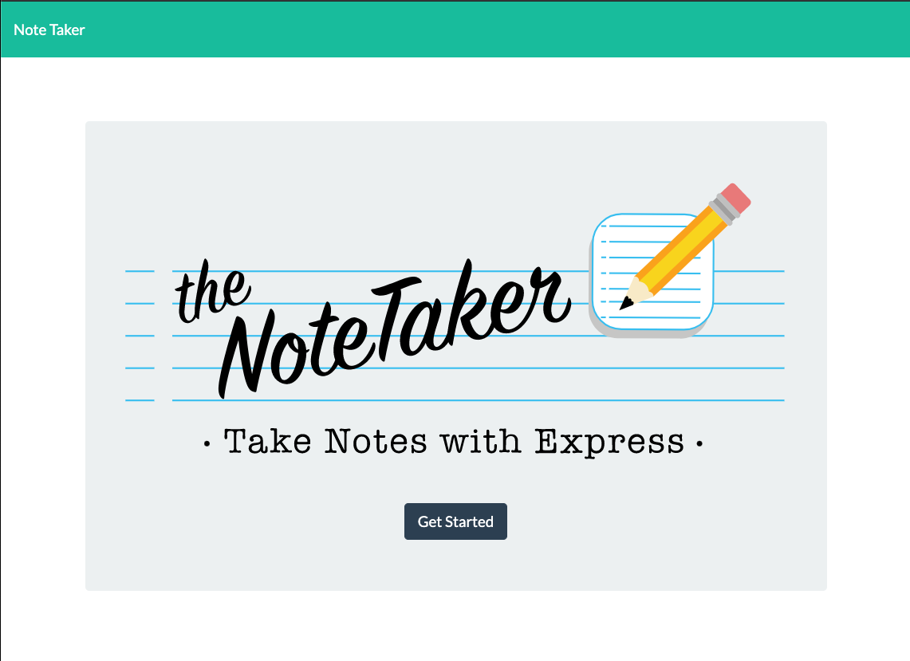

# Note_Taker App

## Description 
App allows a user to take notes and store them into a data base. This will help the user organize and keep track of important information.   

## Screenshot

## Table of contents
- [Description](#Description)
- [Installation](#Installation)
- [Repository Link](#Repository)
- [Diployed App Info](#App) 
- [GitHub Info](#GitHub) 
## Installation
        npm install

## Repository
- [Express Notetaker App Repo](https://github.com/bartcusick/Note_Taker)

## App
- [Express Notetaker App on Heroku](https://notes2501.herokuapp.com/)
## GitHub
- Email: bartcusick@gmail.com
- [GitHub Profile](https://github.com/bartcusick)
# Note_Taker App

## Description 
App allows a user to take notes and store them into a data base. This will help the user organize and keep track of important information.   

## Screenshot

## Table of contents
- [Description](#Description)
- [Installation](#Installation)
- [Repository Link](#Repository)
- [Diployed App Info](#App) 
- [GitHub Info](#GitHub) 
## Installation
        npm install

## Repository
- [Express Notetaker App Repo](https://github.com/bartcusick/Note_Taker)

## App
- [Express Notetaker App on Heroku](https://notes2501.herokuapp.com/)
## GitHub
- Email: bartcusick@gmail.com
- [GitHub Profile](https://github.com/bartcusick)
